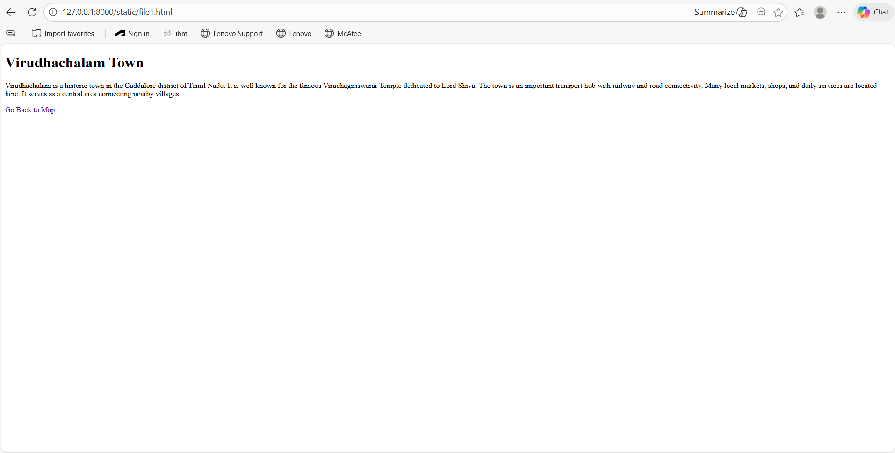
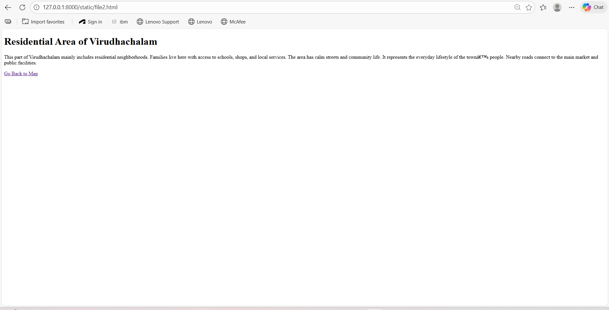
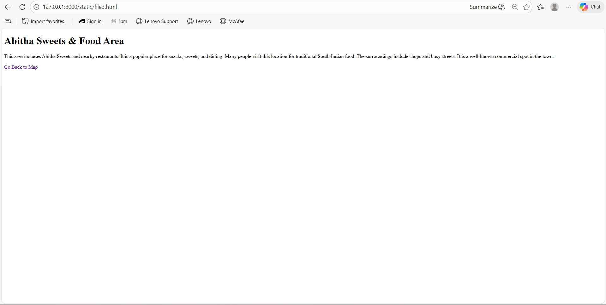
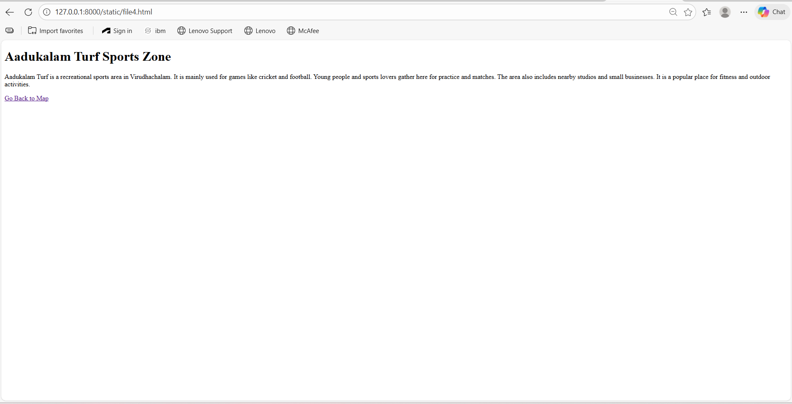

# Ex03 Places Around Me
## Date: 12/02/2026

## AIM
To develop a website to display details about the places around my house.

## DESIGN STEPS

### STEP 1
Create a Django admin interface.

### STEP 2
Download your city map from Google.

### STEP 3
Using ```<map>``` tag name the map.

### STEP 4
Create clickable regions in the image using ```<area>``` tag.

### STEP 5
Write HTML programs for all the regions identified.

### STEP 6
Execute the programs and publish them.

## CODE
```
<!DOCTYPE html>
<html>
<head>
    <title>Image Map Example</title>
</head>
<body>

<center><h1>Megha(212224230157)</h1></center>


<map name="image-map">

    <area shape="rect"
          coords="875,227,952,264"
          href="file1.html"
          alt="Rectangle"
          title="Open File 1">

    <area shape="poly"
          coords="397,202,568,207,411,259,527,261,567,208,402,249"
          href="file2.html"
          alt="Polygon"
          title="Open File 2">

    <area shape="circle"
          coords="1570,131,79"
          href="file3.html"
          alt="Circle 1"
          title="Open File 3">

    <area shape="circle"
          coords="1224,573,123"
          href="file4.html"
          alt="Circle 2"
          title="Open File 4">

    <area shape="circle"
          coords="415,688,146"
          href="file6.html"
          alt="Circle 3"
          title="Open File 5">

</map>

</body>
</html>
```

## File1:
```

<!DOCTYPE html>
<html>
<head>
    <title>Virudhachalam</title>
</head>
<body>
    <h1>Virudhachalam Town</h1>
    <p>
        Virudhachalam is a historic town in the Cuddalore district of Tamil Nadu.
        It is well known for the famous Virudhagiriswarar Temple dedicated to Lord Shiva.
        The town is an important transport hub with railway and road connectivity.
        Many local markets, shops, and daily services are located here.
        It serves as a central area connecting nearby villages.
    </p>

    <a href="map.html">Go Back to Map</a>
</body>
</html>
```

## File2:
```
<!DOCTYPE html>
<html>
<head>
    <title>Residential Area</title>
</head>
<body>
    <h1>Residential Area of Virudhachalam</h1>
    <p>
        This part of Virudhachalam mainly includes residential neighborhoods.
        Families live here with access to schools, shops, and local services.
        The area has calm streets and community life.
        It represents the everyday lifestyle of the town’s people.
        Nearby roads connect to the main market and public facilities.
    </p>

    <a href="map.html">Go Back to Map</a>
</body>
</html>
```

## File 3:
```
<!DOCTYPE html>
<html>
<head>
    <title>Abitha Sweets Area</title>
</head>
<body>
    <h1>Abitha Sweets & Food Area</h1>
    <p>
        This area includes Abitha Sweets and nearby restaurants.
        It is a popular place for snacks, sweets, and dining.
        Many people visit this location for traditional South Indian food.
        The surroundings include shops and busy streets.
        It is a well-known commercial spot in the town.
    </p>

    <a href="map.html">Go Back to Map</a>
</body>
</html>
```

## File4:
```

<!DOCTYPE html>
<html>
<head>
    <title>Aadukalam Turf Sports Zone</title>
</head>
<body>
    <h1>Aadukalam Turf Sports Zone</h1>
    <p>
        Aadukalam Turf is a recreational sports area in Virudhachalam.
        It is mainly used for games like cricket and football.
        Young people and sports lovers gather here for practice and matches.
        The area also includes nearby studios and small businesses.
        It is a popular place for fitness and outdoor activities.
    </p>

    <a href="map.html">Go Back to Map</a>
</body>
</html>
```

## File6:

```
<!DOCTYPE html>
<html>
<head>
    <title>MG Children's & Maternity Hospital</title>
</head>
<body>
    <h1>MG Children's & Maternity Hospital</h1>
    <p>
        This area is known for MG Children’s and Maternity Hospital,
        an important healthcare center serving families in Virudhachalam.
        It provides medical care for mothers and children.
        Nearby you can find residential areas, pharmacies, and small shops.
        The hospital plays a key role in local healthcare services.
    </p>

    <a href="map.html">Go Back to Map</a>
</body>
</html>

```


## OUTPUT











## RESULT
The program for implementing image maps using HTML is executed successfully.
